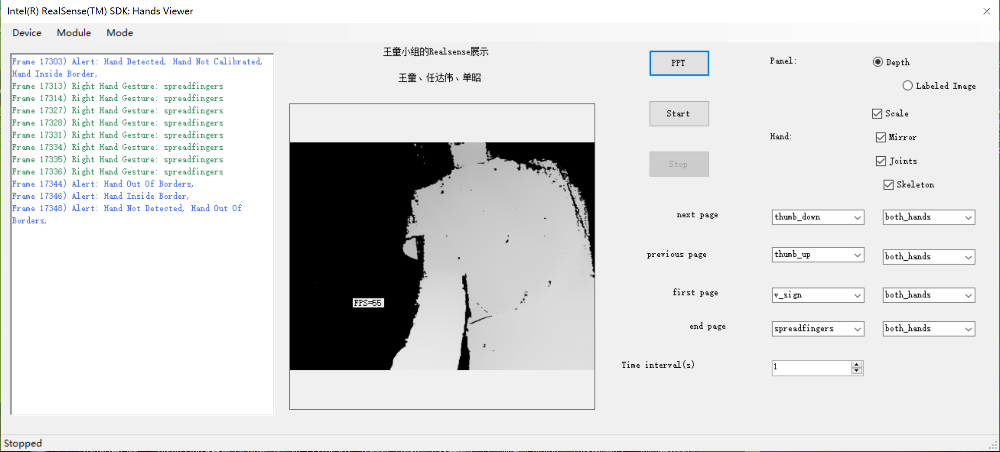

# Realsense手势PPT翻页软件

注意:需要先安装Intel Realsense SDK

下载链接:https://pan.baidu.com/s/1XmYL8oGQoQEoWAUFDvhACQ

软件(位于./RealsenseProject/bin/Debug)界面如下



点击Start开启Realsense(若当前机器没有Realsense会在左侧窗口报错)

右下侧多选框可设置翻页手势,推荐按照如图所示方式进行设置

Time interval: 设置两次翻页间隔时间

PPT: 打开一个本地PPT文件(打开之后即为全屏模式, 取消全屏会丢失PPT句柄, 所以需要先点击Start, 然后设置好相应手势后再打开PPT)

最后, 祝您玩得愉快

## 背景调研

数字计算机自诞生以来已成为人们工作、生活中离不开的一种工具。如今计算机已被广泛用于计算、控制、检测、办公等领域。而随着计算机技术的发展，人与计算机之间的交互方式也一直在改变。早期的计算机系统只能通过命令行界面进行输入输出，只有专业的程序员才有能力操作计算机以完成特定的计算任务。直到上世纪 70 年代之后，人机交互才开始使用图形用户界面。如今我们对于人机交互又有了新的追求，希望计算机能够像人一样感知周围环境、感知用户的反应，已达到更好的人机交互体验。因此近年来，诸如手写识别、语音识别、手势识别等技术发展迅速，虚拟现实、增强现实技术逐渐投入使用，同时也出现了如微软 Kinect、谷歌眼镜等人机交互设备。

为增强人机交互体验，一般而言需要为计算机增加传感手段。而人类感知世界主要以视觉、声音为主，其中又以视觉为主，所占比例超过 80%。就获取图像信息而言，摄像头并不是新奇的硬件设备，但绝大多数现有的数字设备，如手机、平板电脑等，所使用的是 2D 摄像头，仅可以获取 RGB 信息，即平面图像。这种 2D 平面图像与真实世界中的景象与物体仍有较大差异，丢失了现实世界的深度信息。然而深度信息十分重要，人类通过双眼视差获取物体的深度信息，并用于大脑进行运动估计等深层次视觉任务。

本次实验所使用的是 Intel 公司开发的 RealSense 摄像头，其初衷即是模仿人类的视觉感觉器官。最重要的一点是，RealSense 摄像头利用红外成像技术，能够实时输出彩色图像及其深度图，即能够实时地重现图像中每个像素点的空间位置坐标 $(x,y,z)$。

理论上，随着深度信息的加入，手势识别、脸部识别、三维扫描重建等任务的难度也随之降低。但是实际中如何同时运用好 RGB 信息与深度信息，牵涉到很多复杂的计算机视觉算法。一般的开发者直接使用深度摄像头提供的深度信息，其开发的难度很高。本实验使用的是 Intel RealSense SDK，是由 Intel 开发的 RealSense 软件开发工具包，其中内建了手势交互、脸部识别、背景分割、场景感知、三维扫描重建等式计算视觉算法的接口。开发者只需要调用这些接口，开发过程不涉及对底层的深度信息的处理，大大的降低了开发难度。

本实验利用 RealSense 摄像头，实现了通过手势操控游戏的功能。


## 方法描述

本次人机交互大作业的代码全部使用C#

由于不同的手势对应了不同的操作内容，我们定义了一个新的GestureDetect类来保存对应不同手势的委托函数，并且通过限定连续两次识别时间间隔来实现防抖动功能。

```c#
class GestureDetect
{
    [DllImport("Kernel32.dll")]
    private static extern bool QueryPerformanceCounter(out long data);
    [DllImport("Kernel32.dll")]
    private static extern bool QueryPerformanceFrequency(out long data);

    private string gesture;
    long last, freq;
    public Action handler;
    //private double []xSource = new double[4]; // W, A, S, D, Stop
    //private double []ySource = new double[4]; // W, A, S, D, Stop
    //double xw, yw, xa, ya, xs, ys, xd, yd, xStop,yStop;
    public double xSource, ySource, threshold ;
    Hand handType;
    public GestureDetect()
    {
        gesture = null;
        handType = Hand.LeftHand;
        QueryPerformanceFrequency(out freq);
        QueryPerformanceCounter(out last);
        handler = new Action(() => { });
    }

    public void Check(string currentGesture, Hand _handType, int timeInterval)
    {
        if (currentGesture == gesture && ((handType == Hand.BothHands) || (handType) == _handType))
        {
            long now;
            QueryPerformanceCounter(out now);
            if ((now - last) >= (freq) * timeInterval)
            {
                handler();
                last = now;
            }
        }
    }
    public void Check(double x,double y)
    {
        if((x-xSource)*(x-xSource)+(y-ySource)*(y-ySource) < threshold)
        {
            handler();
        }
    }
    public string Gesture
    {
        get
        {
            return gesture;
        }
        set
        {
            gesture = value;
        }
    }
    public Hand HandType
    {
        get
        {
            return handType;
        }
        set
        {
            handType = value;
        }
    }
}
```

手势识别部分调用了intel Realsense SDK中的库函数，分别获取了手势内容和手的关节位置。示例的代码如下（其实还有很多初始化的设置，为了简短起见，就没有放上去）：

```c#
PXCMHandData.GestureData gestureData;
if (handAnalysis.QueryFiredGestureData(i, out gestureData) == pxcmStatus.PXCM_STATUS_NO_ERROR)
{
    PXCMHandData.IHand handData;
    if (handAnalysis.QueryHandDataById(gestureData.handId, out handData) != pxcmStatus.PXCM_STATUS_NO_ERROR)
        return;

    PXCMHandData.BodySideType bodySideType = handData.QueryBodySide();
    if (bodySideType == PXCMHandData.BodySideType.BODY_SIDE_LEFT)
    {
        gestureStatusLeft += "Left Hand Gesture: " + gestureData.name;
        Gesture_J.Check(gestureData.name,Hand.LeftHand,form.GetInterval());
    }
    else if (bodySideType == PXCMHandData.BodySideType.BODY_SIDE_RIGHT)
    {
        gestureStatusRight += "Right Hand Gesture: " + gestureData.name;
        Gesture_J.Check(gestureData.name, Hand.RightHand, form.GetInterval());
    }
}
```

由于intel realsense自带的SDK在手势识别上做的并不完善，一旦同时识别超过四个手势错误率就会变得非常高。所以游戏的控制不能全部使用手势来控制，因此，我们想到了使用手相对于屏幕的位置来控制前进和前进方向，SDK里并没有直接返回手心位置的函数，但是有返回关节位置的函数，于是我们使用各关节位置的平均值来代替手心位置。

```c#
PXCMHandData.IHand handData;
if (handOutput.QueryHandData(PXCMHandData.AccessOrderType.ACCESS_ORDER_BY_TIME, i, out handData) == pxcmStatus.PXCM_STATUS_NO_ERROR)
{
    if (handData != null)
    {
        //Iterate Joints
        float xsum = 0;
        float ysum = 0;
        int num = 0;
        for (int j = 0; j < 0x20; j++)
        {
            PXCMHandData.JointData jointData;
            handData.QueryTrackedJoint((PXCMHandData.JointType)j, out jointData);
            nodes[i][j] = jointData;
            if(jointData.positionImage.x > 0 && jointData.positionImage.y > 0)
            {
                xsum += jointData.positionImage.x;
                ysum += jointData.positionImage.y;
                num++;
            }

        } // end iterating over joints
        float xmean = xsum / num;
        float ymean = ysum / num;
        //Console.WriteLine(String.Format("({0},{0})",xsum/num ,ysum/num ));
        form.DisplayHandPointAndPressKey(xmean, ymean);
    }
}
```

中期验收中控制PPT是通过调用微软SDK获取打开的PPT的句柄来进行操作的，而控制游戏则相对容易一些，直接模拟键盘按键即可。

```c#
public const byte vbKeyA = 65;
public const byte vbKeyD = 68;
public const byte vbKeyS = 83;
public const byte vbKeyW = 87;

[DllImport("user32.dll")]
public static extern void keybd_event(byte bVk, byte bScan, int dwFlags, int dwExtraInfo);

private void W_Click(object sender, EventArgs e)
{
    //模拟按下W键
    keybd_event(vbKeyW, 0, 0, 0);
    //松开按键DOWN
    keybd_event(vbKeyW, 0, 2, 0);

}
```


## 成果结论

具体效果可以参见所附的视频。

如下的视频截图说明实现了用不同的手势以及手的位置，去控制游戏人物的动作。

### 操作界面


该操作界面可以实时显示手势的识别结果，手势相对于屏幕的位置，并提供了修改按键绑定手势和左右手的选择框。

### 左右移动

当识别到张开手掌位于右侧四分之一区域时，控制人物向右移动。


### 跳起

当识别到张开手掌位于上方四分之一区域时，控制人物向上跳起。


### 下蹲

当识别到张开手掌位于上方四分之一区域时，控制人物下蹲防御。


### 重拳

当识别到手呈握拳状时，控制人物出重拳。


### 轻拳

当识别到手呈V字状时，控制人物出轻拳。


### 肘击

当识别到手呈向下大拇指状时，控制人物出肘击。


## 思考讨论

为了完成这次的人机交互实验中，我们完整地阅读了Intel Realsense SDK所提供的帮助文档，这极大地提高了我们的英文和代码阅读能力。并且由于网上Realsense相对于Kinect的学习资料相对较少，且存在版本不同的问题。在面对写代码过程中遇到的问题时，我们只能自己想办法去解决。这其中遇到了不少困难，例如一开始为了让Realsense在电脑上跑起来就花费了接近一个晚上的时间。而这个过程也极大地磨练了我们的意志力和解决问题的能力。在以后的工作中，我们还会遇到比这难无数倍的问题，但是有了这次的经验，我们以后在面对那些问题时将会从容不少。

另外，这次的人机交互实验也开拓了我们的视野，以后在遇到一些项目的时候，也许我们可以从曾经做过的这个大作业中找到一些灵感。

## 组内分工

王童：代码编写，游戏方案设计

任达伟：SDK查询，代码测试，拍摄，总结报告撰写

单昭：文献调研，SDK查询